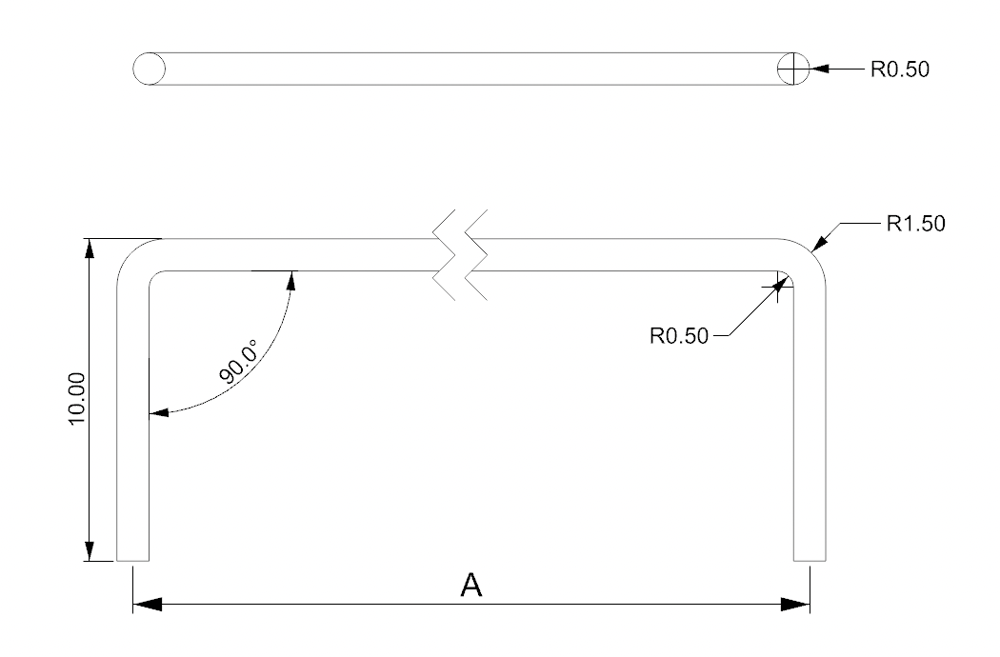

# Alkene
Universal key stabilizer for low profile keyboards.

This is a stab (pun intended) at creating a universal stabilizer model for low-profile keyboards.

Unfortunately when it comes to low profile mechanical keyboard switches, there isn't a standard. There are plenty of switches with subtle yet significant differences in their travel, alignment, spacing etc. This stabilizer aims to overcome those differences by providing a one-size fit all solution. It does that by providing enough margin and headroom on all levels, which also has the added benefit of being able to adjust for slight mistalignment when using different brand, custom or 3d-printed keycaps.  
The downside is they require a relatively large PCB cutout - no way around this as there's sometimes just 1mm between the switchplate and PCB, and the stabilizer needs to support at least 3mm of travel. They are designed to fit around the switch on either side, even if there's a slight offset on the connectors, hopefully making for an easier time when routing the PCB.

### How does it work?

The stabilizer is designed to clip into the switchplate from the top, making it possible to insert and/or remove them without removing the PCB from the assembly.

### Choc vs MX version

There's a Choc and MX version of the model. Currently, the only difference between the two is different connector cross dimensions and the recommended wire length.

## Recommended dimensions

All dimensions are in **mm**.

**Important:** The following diagrams assume the stabilizer connectors is on the same axis as the switch (MX). If the keycaps have offset stabilizer connector placement (for example 0.45mm for regular Choc keycaps), this is not included on the images below.

### Wire

### Plate Cutouts

### PCB Cutouts

### Recommended A values:

| Switch Type | Size  | Value |
| ----------- | ----- | ----- |
| MX          | 2u    | 23.9  |
| MX          | 6.25u | 100.0 |
| Choc        | 2u    | 24.0  |
| Choc        | 6.25u | 76.0  |
